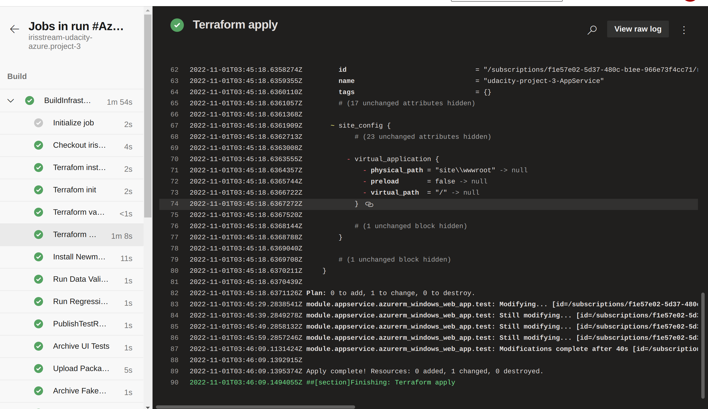
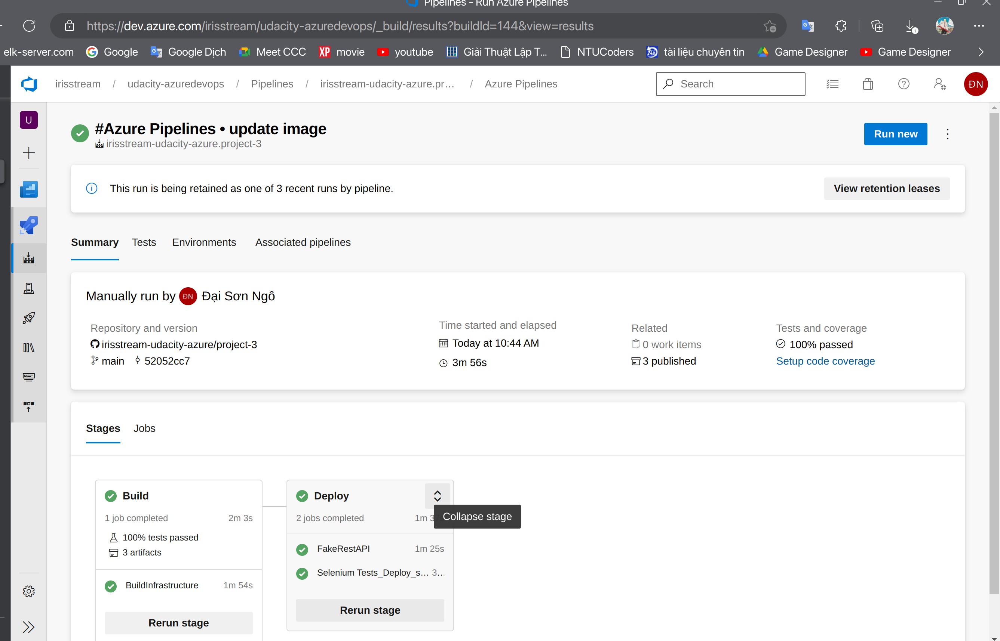
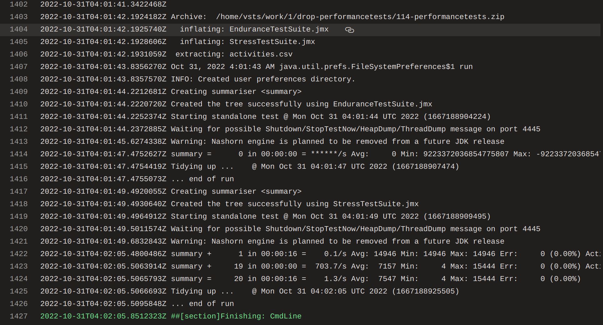
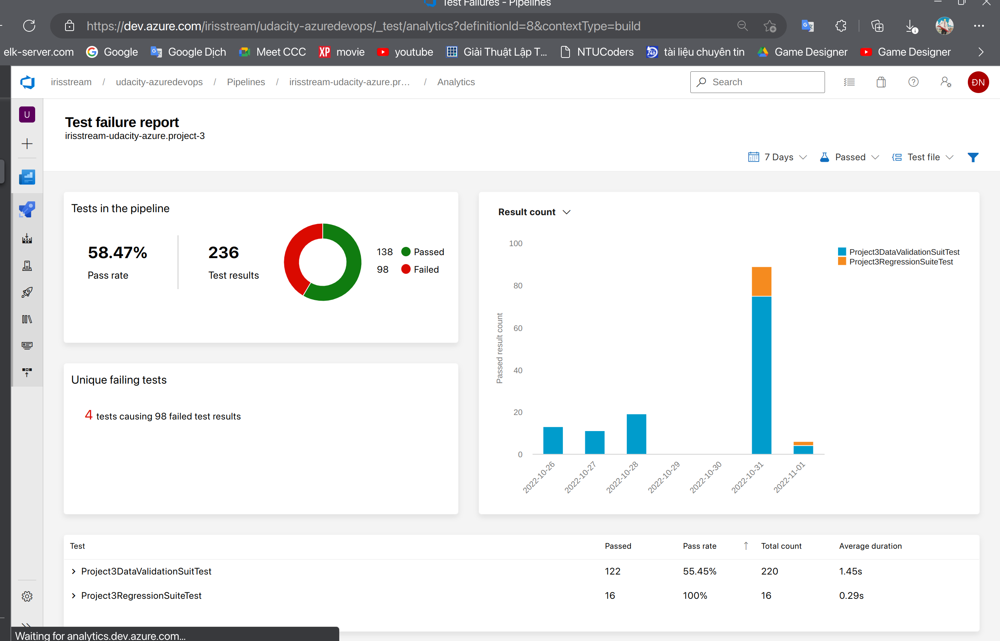
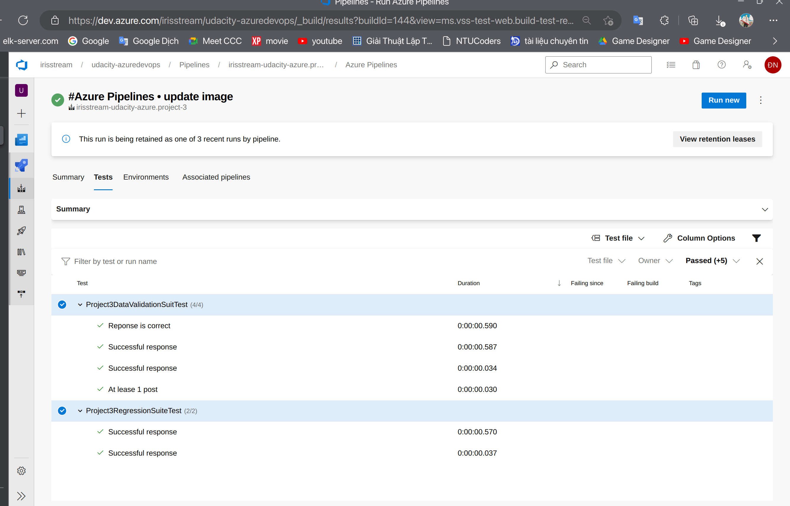
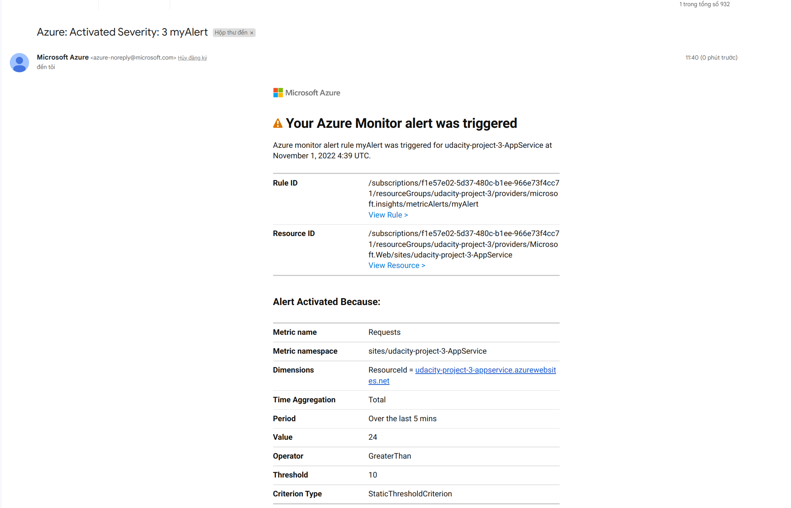
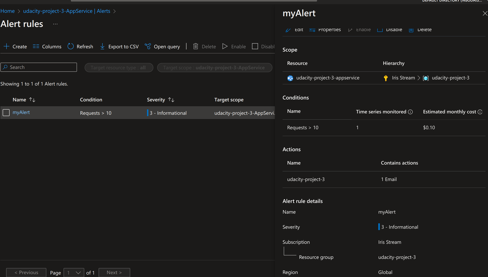
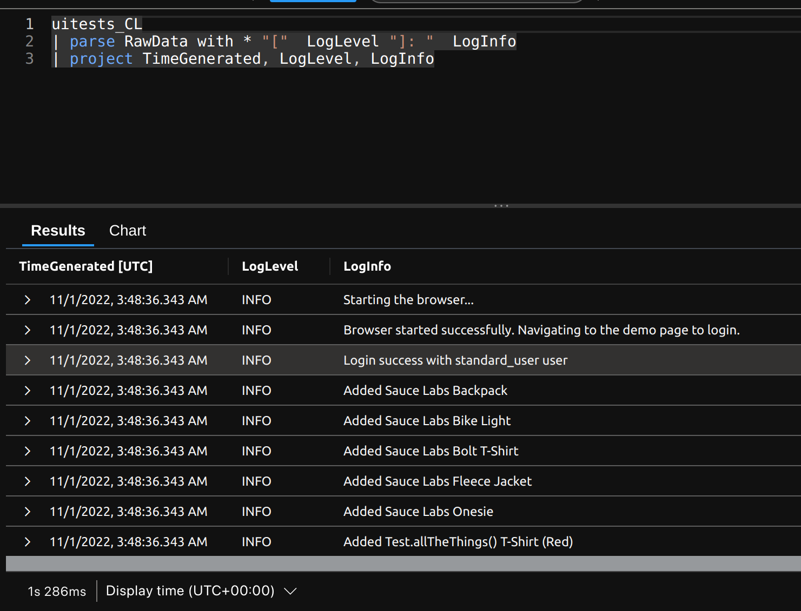
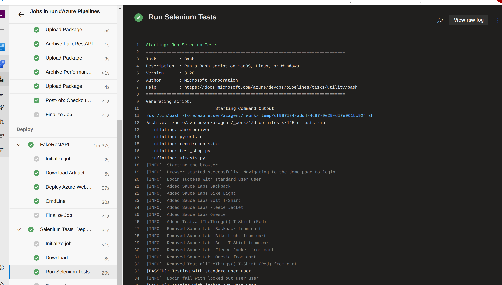

# Project 3

## Run IaC with Terraform

## Successful execution of the pipeline build results page

## Performance test
### HTLM Report
- [Endurance Test Suite](./automatedtesting/jmeter/test-suite/test-results/endurance-test.zip)

- [Stress Test Suite](./automatedtesting/jmeter/test-suite/test-results/stress-test.zip)

### Jmeter output
 
## Integration Test
### Run Summary page 

### Test results page

## Alert
### Email

### Resources metric

## Log analytic
### Log query

### Selenium execution output

